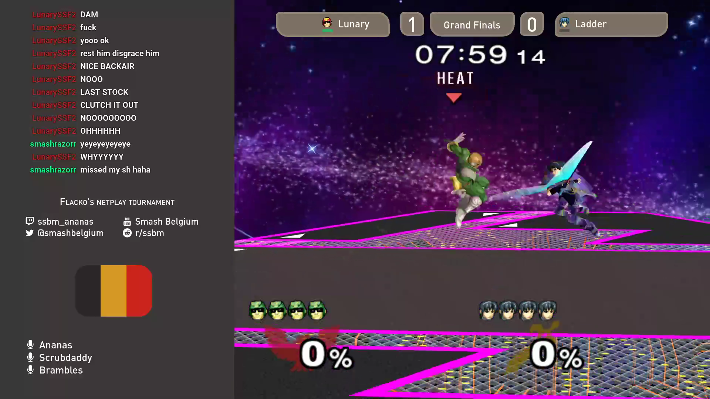

# Melee Dark
## [scoreman](https://github.com/N0NamedGuy/scoreman) stream overlay for ssbm using gruvbox theme

Here is an example (the flag and the chat are on top of the overlay)

### How should I install it ?
Just follow the guide in the install section of the [scoreman documentation](https://github.com/N0NamedGuy/scoreman/blob/master/docs/overlays.md).

### Hey, how could I create mine ?
Fortunatly there is also a section about creating a overlay in the [scoreman documentation](https://github.com/N0NamedGuy/scoreman/blob/master/docs/overlays.md).
